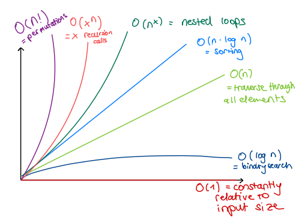
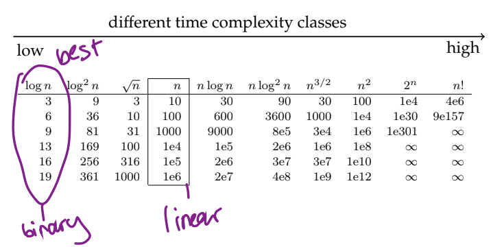

# Algortihmic complexity

### How do we define what degree of complexity an algortihm has?

- Time complexity: running time of the algorithm
- Space complexity: how much memory is it using
- Size of input data: number of items, number of bits

### Random access machine

- Arithmetic: addition, subtraction, multiplication
- Control: branch, subroutine call, return
- Data movement: load, store, copy
- data types: char, integer and floating point (decimal)

### Analysis of insertion sort

```
for i=2 to n do
    j = i-1;
    t = A[i];
    while j>0 · t<A[j] do
        A[j+1] = A[j];
        j = j-1;
    A[j+1] = t;
```

Execution of a line costs time. Each line has a cost of $\textbf c$. This cost is multiplied by as many elements have to be processed by the algorithm. Inside loops, we use the notation $\textbf t_i$. The sum of all multiplications between $c$, $n$ and $t_i$ gives as the exact running time of insertion sort.

### Best, worst and average case

Considering insertion sort, our best case option is that the array is already sorted: $t_i = 1$
$$ T(n) = c_1n + (c_2 + c_3 + c_4 + c_7)(n-1) = an+b $$

In the worst case, our array is reverse sorted: $t_i = i$
$$ T(n) = c_1n + (c_2 + c_3 + c_7) + c_4(\frac{n(n+1)}{2} - 1) + (c_5 + c_6) \frac{(n-1)n}{2} = an^2 + bn + c$$

We usually focus on the worst case running time, due to following reasons:

- It guaranted to not take longer
- It occurs fairly often
- The average case is often close to the worst case

### Example: Binary search

```
i = 1;
while <= n and A[i] != v do i = i+1;
if i <= n then return i else return NIL;
```

- Worst case: $n$ (The element we are looking for is at the end of the array $A[1..n]$)
- Average case: $n/2$
- Best case: 0 (The element is not in the array)

# Correctness

An algorithm is correct when:

- it produces the desired output for any legal input (partial correctness)
- it terminates (total correctness)
- Assertion: statement about the state before execution of the algorithm
- Preconditions: assertion about the input, must be valid before execution
- Postconditions: assertion about the output, must be valid after execution

### Loop invariants

- Intialization: true before first iteration
- Maintainence: true before an iteration and then true after iteration
- Termination: show that algorithm is correct

### Example: sorting
```
// Input: an array A storing n integers
// Output: the same array with the elements sorted
in ascending order
// Invariant: A[0..j-1] contains the same elements 
as the original subarray A[0..j-1], but in sorted order.

for j = 1 to n-1
        key ← A[j]
        i ← j - 1
        while i >= 0 and A[i] > key
            A[i+1] ← A[i]
            i ← i - 1
        A[i+1] ← key
```

Let’s look at the **initialization** property. We can assume that the slice contains at least two elements since the loop wouldn’t execute otherwise. (Nor is this needed since a slice with at most one element is sorted already.) Before executing the loop, the invariant states “A[0..0] contains the same elements as the original subarray A[0..0], but in sorted order”. This is clearly true.

To verify the **maintenance** property, we need to take a closer look at the code. We can assume that the invariant holds before the loop, i.e. A[0..j-1] is sorted, and only need to check that the code inserts the element A[j] in the correct position. This is achieved by moving all elements A[j-1], A[j-2],… larger than A[j] one step to the right and then inserting A[j] in its proper position.

To achieve the **termination** property, the invariant should state that the array is sorted when the for loop terminates. Check.

Check [here](https://www.geeksforgeeks.org/loop-invariant-condition-examples-sorting-algorithms/) for more.

# Asymptotic complexity

Asymptotic complexity helps us find out how the running time increases, with the size of the input.

- Big $O$ notation: Upper bound, used for worst case analysis.
- Big $\Omega$ notation: Lower bound, used for best-case analysis
- Big $\Theta$ notation: Tight bound (range between upper and lower bound), used for average-case analysis





Check [here](https://www.bigocheatsheet.com) for more.

TODO: Check Abdul Bari videos

*TODO: Add one-pager summaries for all algorithms showing their strengths and weaknesses, visual representation, optimized usage, big O analysis, code representation with links to HackerRank exercises.*

### Logarithmic rules

- $log_a(bc) = log_a b + log_a c$
- $log_a b = \frac{log_c b}{log_c a}$
- $log_a b^c = c ⋅ log_a b$
- $a^ma^n = a^{m+n}$
- $a^{log_a b} = b$
- $lg b = ldb =log_2 b$
- $log_a b = ^alog b$

# Special case analysis

- Data structure (array, list, file, etc.)
  - Empty, single element, completely filled
- Particular values, border of domain
  - Zero, empty string, negative numbers, etc.
- Calling of functions (procedures)
  - Entering function, termination of function
- Control and loop statements
  - Start of loop, end of loop, 1st iteration